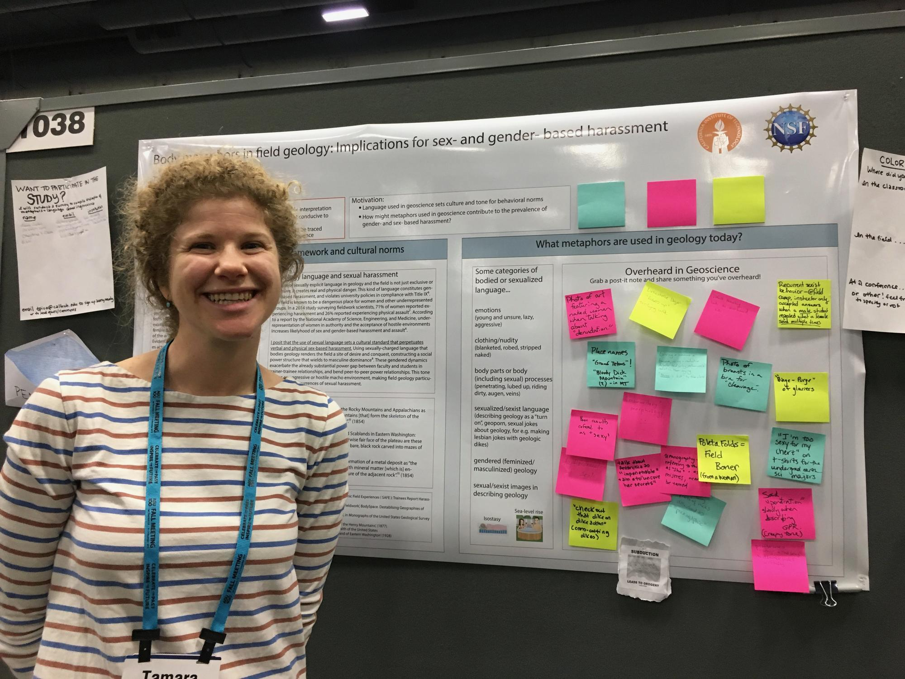
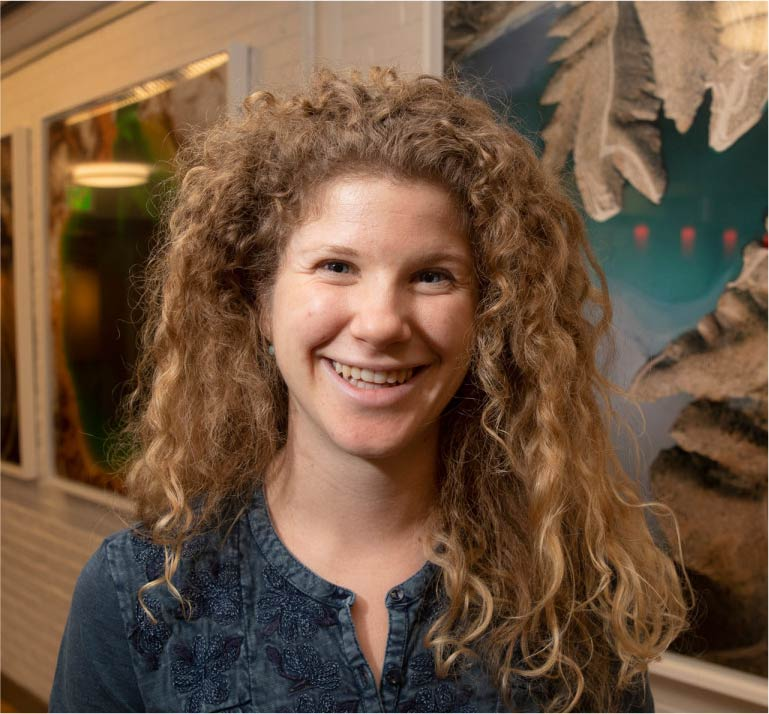

# Welcome to Geometaphors 

<!-- Global site tag (gtag.js) - Google Analytics -->

> Take the (5-min) survey!

This study aims to document gendered and sexual language in the geosciences. Led by the Pico Group at University California Santa Cruz, this anonymous 5-minute survey will be analyzed for an undergraduate senior thesis.

## Motivation 
The language and metaphors used in the geosciences contributes to the culture and norms within the discipline. The structure of language can shape our world view, bounding how we communicate our human emotions or even the color of the sea (1). Scholars have shown that the assumptions we make about objects of scientific inquiry, especially the names assigned, can have real effects for our understanding of scientific processes (2,3).

At an interactive AGU poster in 2019, PI Tamara Pico collected examples of gendered or sexual language overheard in the geosciences from scientists like you. She found that the encountered language was sometimes striking and memorable, but other times routine and quotidian. Some people were extremely familiar with this type of language, and others had never heard it. This survey seeks to document gendered and sexual language within the geosciences to learn about its presence and the forms this language can take.

<h4 style="color: black; text-align: left;">Body Metaphors AGU Poster</h4>

See the <a href="https://eos.org/articles/body-based-jargon-can-be-harassment-when-it-turns-sexual" target="_blank">EOS article</a> to learn more about the 2019 AGU poster!

<!-- Container for the AGU poster and two additional images -->

  <!-- Main AGU Poster Image -->
  

  <!-- Container for the two additional images -->
  

    <!-- Post-It Image 1 -->
    
    
    <!-- Post-It Image 2 -->
    
  

  <h4 style="color: black;">Why we need your help!</h4>
  
We need your help to learn about the presence of gendered or sexual language in the geosciences! Whether you have heard this type of language or not, your participation in our survey will help us discover what kinds of gendered or sexual language is being said and in which subdisciplines.

<h3 style="color: black;">The Team</h3>

<!-- First team member -->

  

    
    
Tamara Pico

  

  

     Tamara Pico (she/her) is an Assistant Professor in Earth and Planetary Sciences at UC Santa Cruz, affiliated with the UCSC Science & Justice Research Center. Her research focuses on ice age sea level, in addition to analyzing cultures and practices in the geosciences.
  

<!-- Second team member -->

  

    
    
Lydia Vance

  

  

    Lydia Vance (she/her) is an undergraduate senior thesis student at UC Santa Cruz (Class of 2025) and is a double major in Environmental Sciences and Feminist Studies.
  

<!-- Third team member -->

  

    
    
Kathryn Clancy

  

  

     <a href="https://clancylabs.com/" target="_blank"> Kathryn Clancy </a> (she/her) is an Associate Professor of Anthropology at the University of Illinois, Urbana-Champaign. She is a human reproductive ecologist who specializes in women’s health, endometrial function, and evolutionary medicine. She has coauthored the <a href="https://www.nationalacademies.org/our-work/sexual-harassment-in-academia" target="_blank" style="color: blue;">National Academies report</a> on sexual harassment of women in STEM and led the <a href="https://journals.plos.org/plosone/article?id=10.1371/journal.pone.0102172" target="_blank" style="color: blue;">SAFE survey</a> on academic field experiences of harassment and assault.   
  

<!-- Fourth team member -->

  

   
    
Jane Willenbring

  

  

     Jane Willenbring (she/her) is an Associate Professor of Earth and Planetary Sciences at Stanford University who studies the earth surface. 
  

