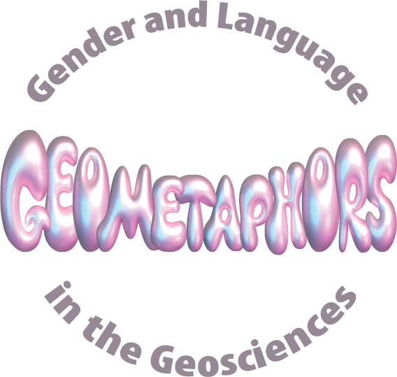
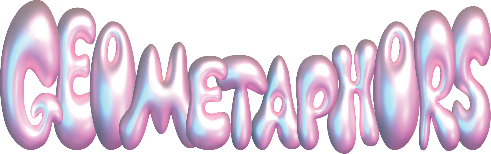

<!-- Global site tag (gtag.js) - Google Analytics -->

## Welcome to Geometaphors
This study aims to find out more about gendered, sexist, and sexual language in the geosciences.

# <em> <a href="https://ucsantacruz.co1.qualtrics.com/jfe/form/SV_0jpXkdWUck2nUvI" target="_blank" style="color:#EC5578;">Take the (3-min) survey!</a> </em>
 

## Motivation 
The language and metaphors used in the geosciences contributes to the culture and norms within the discipline. The structure of language can shape our world view, bounding how we communicate our human emotions or even the color of the sea (1). Scholars have shown that the assumptions we make about objects of scientific inquiry, especially the names assigned, can have real effects for our understanding of scientific processes (2-5).

At an interactive AGU poster in 2019, PI Tamara Pico collected examples of gendered or sexual language overheard in the geosciences from scientists like you. She found that the encountered language was sometimes striking and memorable, but other times routine and quotidian. Some people were extremely familiar with this type of language, and others had never heard it. This survey seeks to document potentially gendered, sexist, and sexual language within the geosciences to learn about its presence and the forms this language can take.

See the <a href="https://eos.org/articles/body-based-jargon-can-be-harassment-when-it-turns-sexual" target="_blank" style="color:#EC5578;">EOS article</a> to learn more about the 2019 AGU poster!

<!-- Container for the AGU poster and two additional images -->

  <!-- Main AGU Poster Image -->
  

  <!-- Container for the two additional images -->
  

    <!-- Post-It Image 1 -->
    
    
    <!-- Post-It Image 2 -->
    
  

  
 

## Whether you've heard it or not. 
  
 We need your help to learn about potentially gendered or sexual language in the geosciences! Whether you have heard this type of language or not, your participation in our survey will help us discover what is being said and in which subdisciplines.

  
## The Team 

<!-- First team member -->

  

    
    
Tamara Pico

  

  

     <a href="https://tamarapico.github.io/" target="_blank" style="color:#EC5578;">Tamara Pico  </a> (she/her) is an Assistant Professor in Earth and Planetary Sciences at UC Santa Cruz, affiliated with the UCSC Science & Justice Research Center. Her research focuses on ice age sea level, in addition to analyzing cultures and practices in the geosciences.
  

<!-- Second team member -->

  

    
    
Lydia Vance

  

  

    Lydia Vance (she/her) is an undergraduate senior thesis student at UC Santa Cruz (Class of 2025) and is a double major in Environmental Sciences and Feminist Studies.
  

  

    
    
Kathryn Clancy

  

  

    <a href="https://clancylabs.com/" target="_blank" style="color:#EC5578;">Kathryn Clancy</a> (she/her) is an Associate Professor of Anthropology at the University of Illinois, Urbana-Champaign. She is a human reproductive ecologist. She has coauthored the <a href="https://www.nationalacademies.org/our-work/sexual-harassment-in-academia" target="_blank" style="color:#EC5578;">National Academies report</a> on sexual harassment of women in STEM, and led the <a href="https://journals.plos.org/plosone/article?id=10.1371/journal.pone.0102172" target="_blank" style="color:#EC5578;">SAFE survey</a> on academic field experiences of harassment and assault.
  

<!-- Fourth team member -->

  

    
    
Jane Willenbring

  

  

    <a href="https://lifelandscape.stanford.edu/people/jane-willenbring" target="_blank" style="color:#EC5578;">Jane Willenbring </a> (she/her) is an Associate Professor of Earth and Planetary Sciences at Stanford University who studies the earth surface.
  

<!-- References -->

  <h3 style="text-align: center; color: black;">References</h3>
  <ul style="list-style-type: decimal; margin-left: 20px;">
    
    1. Deutscher, G. <em>Through the Language Glass</em> (2010).
     
    2. Wylie, Alison. ‘How Archaeological Evidence Bites Back’ (2017).
     
    3. van Anders, Sari M. ‘Beyond Masculinity: Testosterone, Gender/Sex, and Human Social Behavior in a Comparative Context’ (2013).
     
    4. Martin, Emily. ‘The Egg and the Sperm: How Science Has Constructed a Romance Based on Stereotypical Male-Female Roles’ (1991), 485–501.
     
    5. Thibodeau, Paul H., et al. ‘How Linguistic Metaphor Scaffolds Reasoning’ (2017).

  </ul>
    
   <!--  -->

