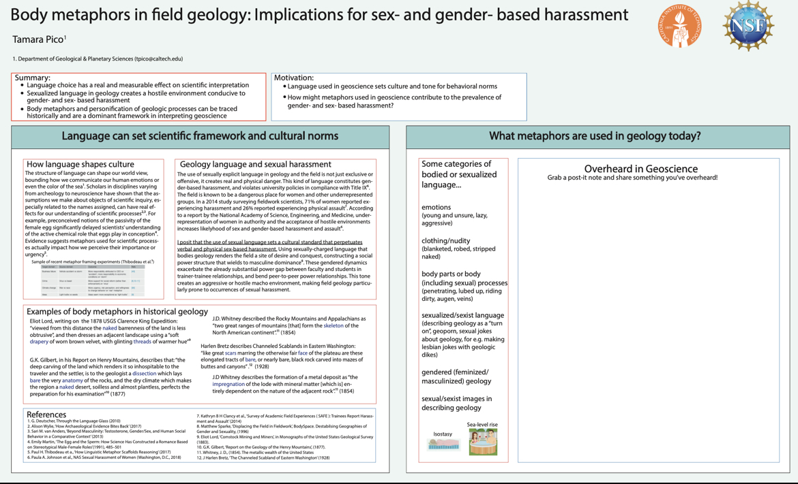

# Welcome to Geometaphors 

<!-- Global site tag (gtag.js) - Google Analytics -->

> Take the (5-min) survey!

This study aims to document gendered and sexual language in the geosciences. Led by the Pico Group at University California Santa Cruz, this anonymous 5-minute survey will be analyzed for an undergraduate senior thesis.

## Motivation 
The language and metaphors used in the geosciences contributes to the culture and norms within the discipline. The structure of language can shape our world view, bounding how we communicate our human emotions or even the color of the sea (1). Scholars have shown that the assumptions we make about objects of scientific inquiry, especially the names assigned, can have real effects for our understanding of scientific processes (2,3).

At an interactive AGU poster in 2019, PI Tamara Pico collected examples of gendered or sexual language overheard in the geosciences from scientists like you. She found that the encountered language was sometimes striking and memorable, but other times routine and quotidian. Some people were extremely familiar with this type of language, and others had never heard it. This survey seeks to document gendered and sexual language within the geosciences to learn about its presence and the forms this language can take.

See the <a href="https://eos.org/articles/body-based-jargon-can-be-harassment-when-it-turns-sexual" target="_blank">EOS</a> article to learn more about the 2019 AGU poster!

## Why we need your help!
We need your help to learn about the presence of gendered or sexual language in the geosciences! Whether you have heard this type of language or not, your participation in our survey will help us discover what kinds of gendered or sexual language is being said and in which subdisciplines.

## The Team

  
  

    Tamara Pico 
     (she/her), Assistant Professor, Earth & Planetary Sciences, UC Santa Cruz, ice age sea level change 
  

  
  

    Lydia Vance 
     (she/her), Undergraduate, Earth & Planetary Sciences, UC Santa Cruz 
  

  
  

    Kate Clancy 
     (she/her), Biological Anthropologist, Department of Anthropology, University of Illinois at Urbana-Champaign 
  

  
  

    Jane Willenbring 
     (she/her), Assistant Professor, Earth and Planetary Sciences, Stanford University 
  

  <h3>Body Metaphors AGU Poster</h3>
  

